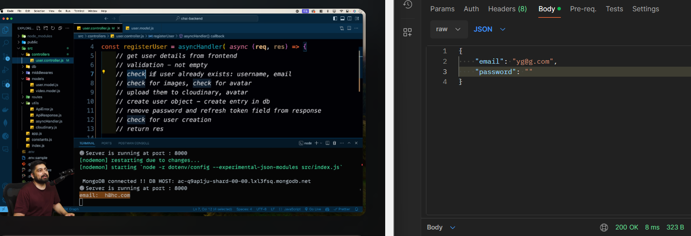
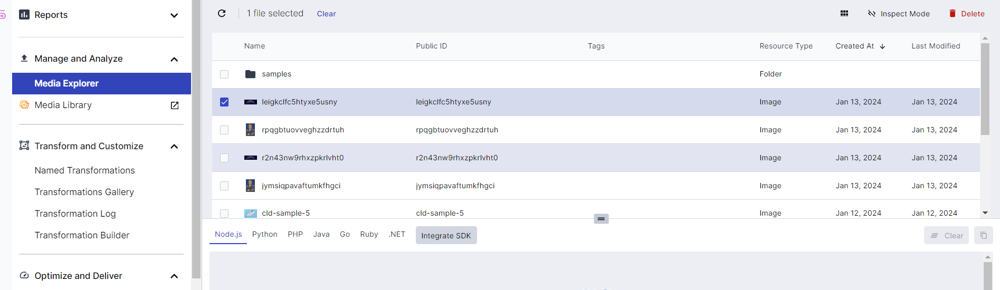
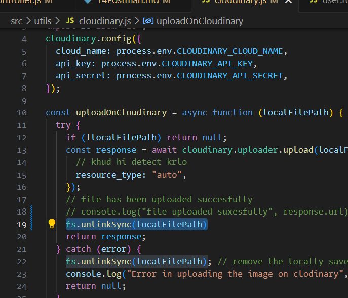
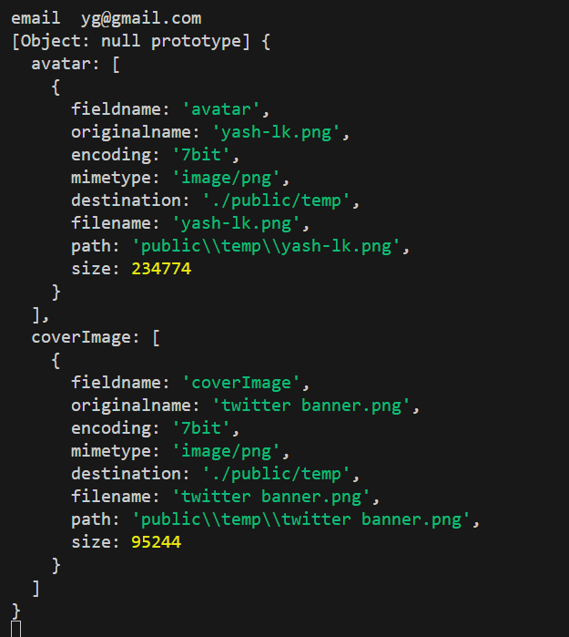
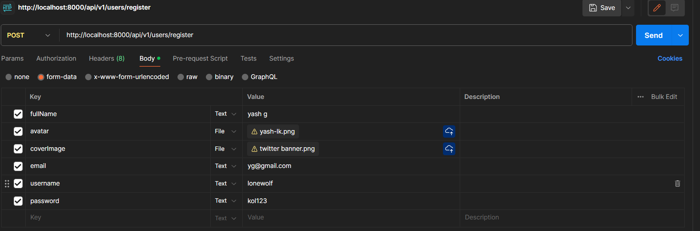

# How to use postman for backend



present in mongo db at, database>data services

At Cloudinary - 


unlinkSync from cloudinary


req.files on console -


postman look

User response - 
```json
{
    "statusCode": 200,
    "data": {
        "_id": "65a28be00e77e69e36d9c0f8",
        "username": "lonewolf",
        "email": "yg@gmail.com",
        "fullName": "yash g",
        "avatar": "http://res.cloudinary.com/dlnruqp9u/image/upload/v1705151454/k1tnpjyszsykge93vzia.png",
        "coverImage": "http://res.cloudinary.com/dlnruqp9u/image/upload/v1705151456/ic7s7cnpelfyrwcc8zkg.png",
        "watchHistory": [],
        "createdAt": "2024-01-13T13:10:56.933Z",
        "updatedAt": "2024-01-13T13:10:56.933Z",
        "__v": 0
    },
    "message": "User registered successfully",
    "success": true
}
```

what if coverImage not sent?

TypeError: Cannot read properties of undefined 

To resolve - 
```js
let coverImageLocalPath;
  if(req.files && Array.isArray(req.files.coverImage) && req.files.coverImage.length >0){
    coverImageLocalPath=req.files.coverImage[0].path;
  }
```

Postman setup done

Final user.controller.js debugged code - 
```js
import { ApiError } from "../utils/ApiError.js";
import { asyncHandler } from "../utils/asyncHandler.js";
import { User } from "../models/user.model.js";
import { uploadOnCloudinary } from "../utils/cloudinary.js";
import { ApiResponse } from "../utils/ApiResponse.js";
const registerUser = asyncHandler(async (req, res) => {
  // 1.get user details from frontend
  // we take fields as it is from user model
  const { fullName, email, username, password } = req.body;
  // console.log("email ", email);
  // 2.validation - check fields not empty

  //Brute force way -
  // if(fullName===""){
  //   throw new ApiError(400,"fullName is required")
  // }
  // Optimal way
  if (
    [fullName, email, username, password].some((field) => field?.trim() === "")
  ) {
    throw new ApiError(400, "All fields are required");
  }
  // 3.check if user already exists: username , email
  const existedUser = await User.findOne({ $or: [{ username }, { email }] });
  if (existedUser) {
    throw new ApiError(409, "User with email or username already exists");
  }
  // 4.check for images and avatar
  // TODO: TASK = console.log(req.files)
  // console.log(req.files) check 14Postman.md
  // we retrieve the local path form avatar and coverImage
  const avatarLocalPath = req.files?.avatar[0]?.path;
  // Problem 
  // const coverImageLocalPath = req.files?.coverImage[0]?.path;
  let coverImageLocalPath;
  if(req.files && Array.isArray(req.files.coverImage) && req.files.coverImage.length >0){
    coverImageLocalPath=req.files.coverImage[0].path;
  }

  if (!avatarLocalPath) {
    throw new ApiError(400, "Avatar Local file is required");
  }
  // 5.upload them to cloudinary and check if they have successfully uploaded or not
  const avatar = await uploadOnCloudinary(avatarLocalPath);
  const coverImage = await uploadOnCloudinary(coverImageLocalPath);
  if (!avatar) {
    throw new ApiError(400, "avatar file is required");
  }
  // 6.create user object , create entry in db
  // for each entry there will be _id field automatically
  // assigned by mongo db
  const user = await User.create({
    fullName,
    avatar: avatar.url,
    coverImage: coverImage ? coverImage.url : "",
    email,
    password,
    username: username.toLowerCase(),
  });
  // 7.remove password and refresh token field from response
  // select mein jo nahi chahiye vo dedo
  // select user w/0 password and refresh token for sending
  // response to the user
  const createdUser = await User.findById(user._id).select(
    "-password -refreshToken"
  );
  // 8.check for user creation based on response
  if (!createdUser) {
    throw new ApiError(500, "Something went wrong while creating a user");
  }
  // 9.if user created return response else return response
  return res
    .status(201)
    .json(new ApiResponse(200, createdUser, "User registered successfully"));
});
export { registerUser };

```